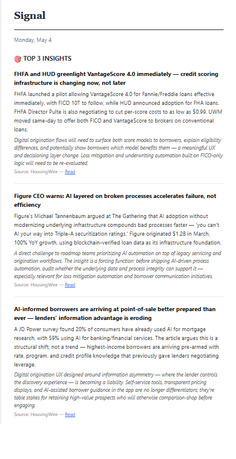

# Signal

A daily AI-curated intelligence digest, delivered by email.

## What is this

Signal is a headless pipeline that aggregates RSS feeds, runs them through Claude for analysis, and emails a structured daily briefing. I built it to track two things at once -- mortgage industry moves and product management thinking -- without spending an hour a day on it.

About 1,500 lines of Node.js, a SQLite database, and a single Claude API call per day.



## How it works

```
  15 RSS feeds + 7 newsroom scrapers
          |
          v
    SQLite (articles table)
          |
          v
    Dedup filter (featured_articles table)
          |
          v
    Claude API (single structured prompt)
          |
          v
    HTML email via Resend
          |
          v
    JSONL archive (append-only)
```

Every morning at 6:30 AM ET:

1. **Fetch** -- Parse RSS feeds and scrape competitor newsroom pages.
2. **Store** -- Upsert articles into SQLite. Deduplicate on URL.
3. **Filter** -- Remove articles that appeared in recent digests (7-day window for insights, 14-day for PM content, 30-day for links).
4. **Analyze** -- One Claude API call produces a structured JSON digest with four sections.
5. **Email** -- Render HTML and send via Resend.
6. **Archive** -- Append the full digest JSON to a local JSONL file.

On Fridays, the pipeline also generates a weekly summary from the last 5 daily digests.

If too few articles survive the dedup filter, Signal sends a short "nothing material today" email instead of forcing weak content through Claude.

## Why I built it

I was spending 30-45 minutes every morning scanning mortgage industry news, competitor press releases, and product management blogs. Most days, 90% of it was noise. I wanted a system that would read everything, surface what matters, and let me start the day with a 2-minute email instead of a 30-minute tab-sprawl.

Signal is what that system turned into.

## Sections in the daily email

Each digest has up to four sections, plus a weekly summary on Fridays:

**Top Insights** -- The 3 most important mortgage industry developments. Each includes a headline, explanation, and connection to digital mortgage product strategy. This section only includes content that directly affects mortgage servicing, origination, or the competitive landscape.

**Competitive Signals** -- 0-3 specific moves by named competitors (Rocket Mortgage, UWM, loanDepot, PennyMac, fintechs). Empty array is fine -- not every day has competitor news.

**Product Craft** -- 0-3 product management articles evaluated purely on PM merit: frameworks, case studies, AI-assisted workflows, leadership thinking. These are judged on the strength of the idea, not on mortgage relevance. The prompt explicitly prevents mortgage articles from being contorted into this section or vice versa.

**Worth Reading** -- 3-5 links that didn't make a top section but are worth 5 minutes. A mix of mortgage and PM content as the day allows.

**Weekly Summary** (Fridays) -- 3-5 bullets synthesizing patterns and action items from the week's digests.

## Architecture

- **Runtime** -- Node.js + Express, single process, port 3001
- **Database** -- SQLite via better-sqlite3. Two tables: `articles` (content storage, 90-day retention) and `featured_articles` (cross-digest dedup tracking)
- **AI** -- Anthropic Claude API (claude-sonnet-4-6 with fallback to claude-sonnet-4-5). One call per digest, ~8K max tokens, temperature 0.25
- **Email** -- Resend (free tier)
- **Sources** -- 15 RSS feeds across 3 categories, plus 7 Cheerio-based HTML scrapers for competitor newsrooms without RSS
- **Archive** -- Append-only JSONL on local disk
- **Deployment** -- systemd user service on a Linux VPS. `node-cron` handles scheduling internally; no external cron dependency

### Source mix

| Category | Sources | What it covers |
|----------|---------|----------------|
| Mortgage industry | 4 feeds | Industry news, regulation, market analysis |
| Product management | 7 feeds | PM craft, AI/workflow thinking, leadership |
| Competitor intel | 4 feeds + 7 scrapers | Press releases and news from specific competitors |

### Cross-digest dedup

The `featured_articles` table prevents the same article from appearing in consecutive digests. Each section has its own exclusion window:

| Section | Window | Rationale |
|---------|--------|-----------|
| Top insights | 7 days | Mortgage news cycles are fast |
| Competitive signals | 7 days | Same |
| Product craft | 14 days | PM sources publish less frequently |
| Worth reading | 30 days | Catch-all; longer window prevents repeats |

Articles excluded by the dedup filter are removed before Claude sees them, so the AI never has to decide whether to re-feature something.

## Tech stack

| Package | Purpose |
|---------|---------|
| `express` | HTTP server |
| `better-sqlite3` | SQLite database |
| `@anthropic-ai/sdk` | Claude API |
| `resend` | Email delivery |
| `rss-parser` | RSS feed parsing |
| `cheerio` | HTML scraping for newsrooms |
| `sanitize-html` | HTML sanitization for reader endpoint |
| `html-entities` | Decode HTML entities in feed titles |
| `node-cron` | Internal scheduling |
| `dotenv` | Environment variable loading |

## Running it yourself

### Prerequisites

- Node.js 18+
- An [Anthropic API key](https://console.anthropic.com/)
- A [Resend API key](https://resend.com/)

### Setup

```bash
git clone https://github.com/tvivaldelli/signal-daily-digest.git
cd signal-daily-digest/server
npm install
cp .env.example .env
# Edit .env with your keys
```

### Environment variables

```
ANTHROPIC_API_KEY=     # Claude API key
RESEND_API_KEY=        # Resend email API key
DIGEST_EMAIL=          # Recipient email address
CRON_SECRET=           # Shared secret for the /run-digest endpoint
APP_URL=               # Base URL for article reader links in emails
```

### Run

```bash
npm start
```

The server starts on port 3001. The internal scheduler runs the digest at 6:30 AM ET daily. To trigger manually:

```bash
curl "http://localhost:3001/run-digest?token=YOUR_SECRET"
```

For a dry run (exclusion report, no Claude call, no email):

```bash
curl "http://localhost:3001/run-digest?token=YOUR_SECRET&dry_run=true"
```

### Adapting for a different domain

The Claude prompt lives in `server/insightsGenerator.js`. It defines the audience context, filtering criteria, section structure, and rules. To repurpose Signal for a different industry, edit that prompt and swap out the RSS sources in `server/sources.json`.

## Limitations

- **Single-user.** No auth system, no multi-tenant support. Designed for one reader.
- **RSS-only.** No paywalled sources, no API integrations beyond RSS and HTML scraping.
- **Opinionated AI lens.** The prompt is biased toward a digital product perspective in mortgage. Your mileage will vary in other domains without prompt tuning.
- **English-only sources.**
- **No web UI.** Email is the only output surface.
- **Local archive.** The JSONL digest history lives on disk. No cloud sync, no backup beyond what you set up yourself.

## License

[ISC](./LICENSE)

## Author

Built by [Tom Vivaldelli](https://github.com/tvivaldelli)
